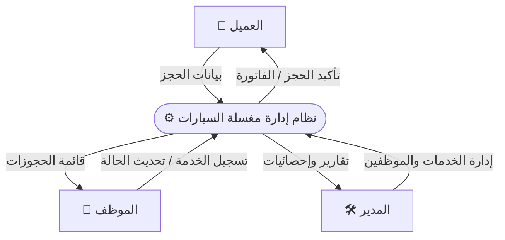
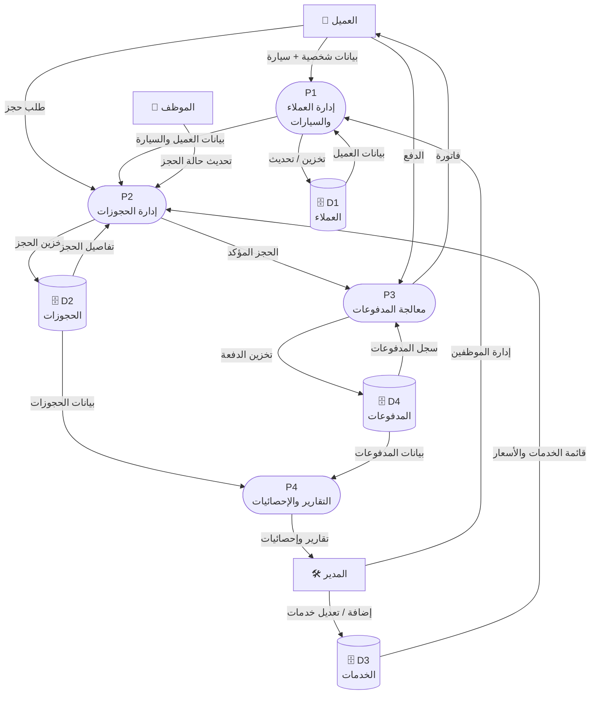

# DFD — مخطط تدفق البيانات

## Level 0 — المنظور العام (Context Diagram)

---

## Level 1 — تفاصيل العمليات الداخلية

---

## شرح العمليات

| العملية | المسؤول | الوصف |
|---------|---------|--------|
| **P1** إدارة العملاء والسيارات | أنت (فرونت اند) + يوسف (API) | إضافة وتعديل بيانات العملاء وسياراتهم |
| **P2** إدارة الحجوزات | أنت + يوسف | حجز جديد، تحديث الحالة، الإلغاء |
| **P3** معالجة المدفوعات | أنت + يوسف | تسجيل الدفع وإصدار الفاتورة |
| **P4** التقارير | أنت (عرض) + يوسف (بيانات) | إحصائيات وتقارير دورية للمدير |

## مصادر البيانات

| المصدر | النوع | الجدول في قاعدة البيانات |
|--------|-------|--------------------------|
| D1 | قاعدة بيانات | `clients` + `cars` |
| D2 | قاعدة بيانات | `bookings` |
| D3 | قاعدة بيانات | `services` |
| D4 | قاعدة بيانات | `payments` |
