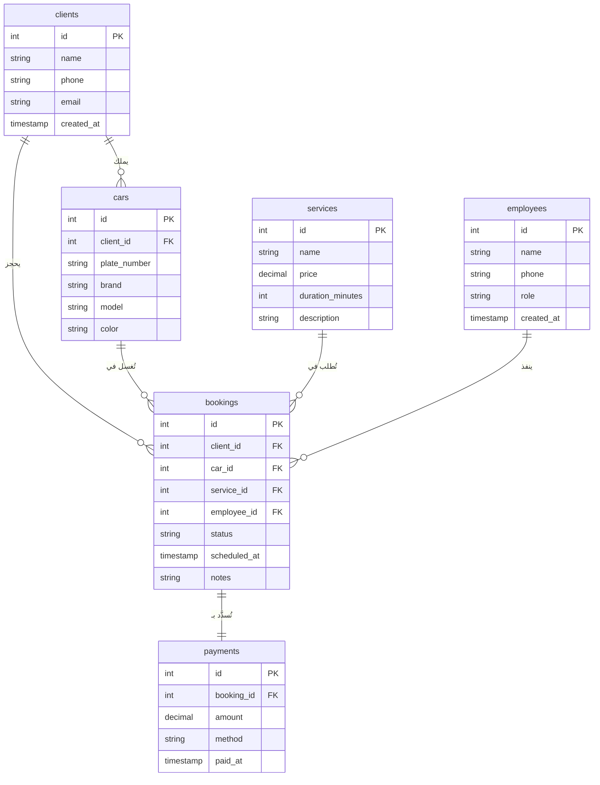

# ERD — مخطط العلاقات بين الجداول

## شرح العلاقات

| العلاقة | النوع | الوصف |
|---------|-------|--------|
| clients → cars | 1 : N | كل عميل ممكن يكون عنده أكتر من سيارة |
| clients → bookings | 1 : N | كل عميل ممكن يعمل أكتر من حجز |
| cars → bookings | 1 : N | نفس السيارة ممكن تتغسل أكتر من مرة |
| services → bookings | 1 : N | نفس الخدمة ممكن تتطلب في حجوزات كتير |
| employees → bookings | 1 : N | كل موظف ممكن ينفذ أكتر من حجز |
| bookings → payments | 1 : 1 | كل حجز ليه دفعة واحدة |

## حالات الحجز (status)

| القيمة | المعنى |
|--------|--------|
| `pending` | تم الحجز، لم يبدأ بعد |
| `in_progress` | السيارة داخل المغسلة دلوقتي |
| `completed` | انتهت الخدمة |
| `cancelled` | تم الإلغاء |
